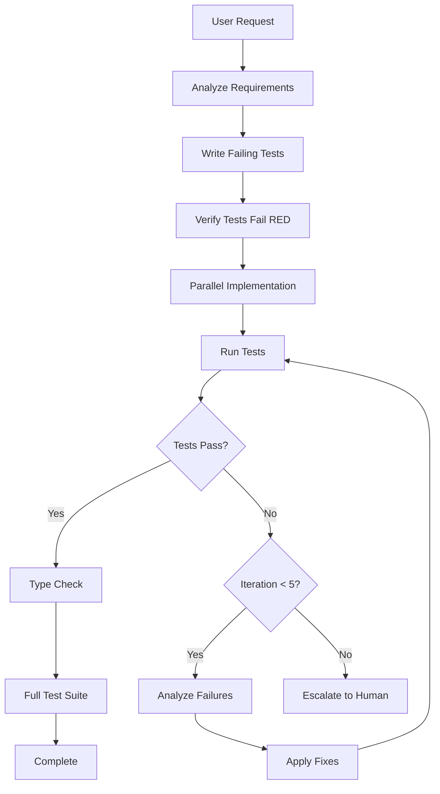

# Autonomous Development with Test-Driven Agents

This guide explains how to use AthleteMetrics' autonomous test-driven development system to implement features with minimal human intervention.

## Overview

The autonomous development system allows you to:
1. Describe a feature in natural language
2. Let agents write tests, implement, and iterate
3. Get fully tested, working code
4. Only intervene when truly blocked

**Key Benefits:**
- ⏱️ **Save Time**: Describe requirements once, agents handle the rest
- ✅ **Quality**: TDD ensures all code is tested
- 🔄 **Iteration**: Agents fix failures automatically (up to 5 attempts)
- 📊 **Visibility**: TodoWrite tracks progress in real-time

## Quick Start

### Basic Usage

```
You: "Implement broad jump measurement tracking with tests"

[Agent automatically:]
1. Writes comprehensive tests
2. Implements database schema
3. Creates form validation
4. Runs tests
5. Fixes any failures
6. Verifies everything passes
7. Reports completion
```

### Advanced Usage

```
You: "Build a coach analytics dashboard showing team performance trends with role-based access. Use TDD approach."

[Agent automatically:]
1. Plans multi-phase implementation
2. Writes test suite covering all requirements
3. Coordinates multiple specialized agents in parallel
4. Implements database, API, and UI layers
5. Runs tests after each phase
6. Iterates on failures
7. Completes with all tests green
```

## The Test-Driven Feature Agent

### What It Does

The `test-driven-feature-agent` is an autonomous orchestrator that:
- Plans feature implementation
- Writes tests FIRST (TDD)
- Invokes specialized agents for implementation
- Runs tests automatically
- Analyzes failures and fixes them
- Iterates up to 5 times
- Escalates true blockers to humans

### How It Works



### Iteration Strategy

The agent has a 5-iteration budget:

| Iteration | Strategy |
|-----------|----------|
| 1-2 | Direct fixes (typos, imports, simple logic) |
| 3 | Re-invoke relevant specialized agent with error context |
| 4 | Expand context, check integration issues |
| 5 | Escalate to human with detailed report |

## Using the System

### Method 1: Direct Invocation

```
You: "Use the test-driven-feature-agent to implement user profile export"
```

### Method 2: Keywords (Automatic)

The agent activates automatically when you use keywords:
- "implement [feature] with tests"
- "TDD approach"
- "autonomous mode"
- "test-first"

```
You: "Implement RSI calculation with TDD approach"
# Agent automatically uses test-driven-feature-agent
```

### Method 3: Complex Features

For multi-system features, be explicit:

```
You: "Implement a new measurement type called 'Reactive Strength Index' (RSI):

Requirements:
- Add RSI to MetricType enum
- Formula: Jump Height (cm) / Ground Contact Time (seconds)
- Create form for data entry
- Add visualization in analytics
- Support historical data analysis
- Role-based access (coaches can enter, athletes can view)

Use TDD approach with autonomous iteration."
```

## Understanding Agent Coordination

### Single-Domain Features

**Example**: Add new measurement type

```
Agents Involved:
1. testing-qa-agent (write tests)
2. database-schema-agent (add to schema)
3. form-validation-agent (create input form)

Execution: Mostly parallel, <15 minutes
```

### Multi-Domain Features

**Example**: Coach analytics dashboard

```
Agents Involved:
1. testing-qa-agent (write tests)
2. database-schema-agent (optimize queries) \
3. security-authentication-agent (permissions) | Parallel
4. api-route-architecture-agent (endpoints)   /
5. analytics-visualization-agent (charts)     | Sequential
6. ui-component-library-agent (dashboard UI) /

Execution: Mixed parallel/sequential, ~45 minutes
```

### Bug Fixes

**Example**: Fix archived teams not showing in analytics

```
Agents Involved:
1. testing-qa-agent (write regression test)
2. database-schema-agent (fix query logic)

Execution: Sequential, <10 minutes
```

## Monitoring Progress

### TodoWrite Tracking

The agent uses TodoWrite to show real-time progress:

```
✅ Write failing tests for RSI calculation
🔄 Implement database schema changes
⏳ Implement API endpoints
⏳ Implement frontend components
⏳ Run tests and iterate until passing
⏳ Verify type checking passes
⏳ Run full test suite
```

### Test Execution Output

You'll see automatic test runs:

```bash
Running tests: npm run test:run

# First run (after writing tests):
❌ FAIL: RSI calculation
❌ FAIL: RSI form validation
❌ FAIL: RSI API endpoint
# Expected! Tests should fail before implementation

# After implementation:
✅ PASS: RSI calculation
✅ PASS: RSI form validation
✅ PASS: RSI API endpoint
```

## What to Expect

### Typical Success Flow

```
[0:00] Request received
[0:02] Requirements analyzed, plan created
[0:05] Tests written and verified failing
[0:10] Implementation started (multiple agents)
[0:20] Implementation complete
[0:21] Tests running...
[0:22] ✅ All tests pass!
[0:23] Type checking...
[0:24] ✅ Types valid!
[0:25] Full test suite...
[0:30] ✅ All 156 tests passing!
[0:30] ✅ Feature complete!
```

### Typical Iteration Flow

```
[0:00] Request received
[0:02] Requirements analyzed
[0:05] Tests written
[0:10] Implementation complete
[0:11] Tests running...
[0:12] ❌ 2 tests failing

[Iteration 1]
[0:13] Analyzing failures...
[0:14] Issue: Missing import in form component
[0:15] Applying fix...
[0:16] Tests running...
[0:17] ❌ 1 test failing

[Iteration 2]
[0:18] Analyzing failures...
[0:19] Issue: Type mismatch in API response
[0:20] Applying fix...
[0:21] Tests running...
[0:22] ✅ All tests pass!
```

### Escalation Flow

```
[0:00] Request received
[0:02] Requirements analyzed
[0:05] Tests written
[0:10] Implementation complete
[0:11] Tests running...
[0:12] ❌ Database connection error

[Iterations 1-4: Various fixes attempted]

[Iteration 5]
[0:45] ⚠️ BLOCKER DETECTED

## Blocker Report: RSI Feature Implementation

**Status**: Blocked after 5 iterations
**Last Error**: Connection refused to database

**Root Cause**: DATABASE_URL environment variable not set

**Human Action Needed**:
Please set DATABASE_URL in .env file and restart dev server

**Attempted Fixes**:
1. Checked schema syntax ✓
2. Verified imports ✓
3. Tested connection logic ✓
4. Reviewed error logs ✓
5. Identified missing env var ✓
```

## Best Practices

### Writing Effective Requests

**Good Requests:**
```
✅ "Implement broad jump measurement tracking with tests"
   - Clear, specific feature
   - Implies TDD

✅ "Add coach analytics dashboard with team comparison charts.
    Requirements: filter by date range, show percentile rankings,
    role-based access. Use TDD approach."
   - Detailed requirements
   - Explicit TDD request

✅ "Fix: Athletes on archived teams don't show in analytics.
    Write regression test first."
   - Clear bug description
   - Requests test-first approach
```

**Unclear Requests:**
```
❌ "Make the app better"
   - Too vague

❌ "Add some charts"
   - Unclear what charts, where, for what data

❌ "Fix the bug"
   - Which bug?
```

### When to Intervene

**Let the agent handle:**
- Test failures (up to 5 iterations)
- Type errors
- Import/module issues
- Logic bugs
- Integration issues

**Intervene when:**
- Missing requirements/ambiguity
- External dependencies (env vars, services)
- Design decisions needed
- Performance regressions detected
- Security vulnerabilities introduced

### Optimizing for Speed

**Parallel vs Sequential:**

```typescript
// BAD: Sequential when parallel is possible
1. Add schema
2. Add API
3. Add form
4. Add UI
// Time: 40 minutes

// GOOD: Parallel where possible
1. Parallel: [Add schema, Add form validation]
2. Sequential: [Add API (needs schema)]
3. Sequential: [Add UI (needs API)]
// Time: 25 minutes
```

The agent automatically optimizes for parallel execution.

## Advanced Usage

### Multi-Feature Requests

```
You: "Implement three new measurement types with TDD:
1. Broad Jump (inches)
2. Med Ball Throw (feet)
3. Pro Agility (seconds)

For each, include:
- Database schema
- Form validation
- Analytics visualization
- Historical tracking"

# Agent will process all three, potentially in parallel
```

### Feature Flags

```
You: "Implement coach premium feature: AI-powered performance insights.
Use TDD approach. Gate behind COACH_AI_INSIGHTS feature flag."

# Agent coordinates:
# - Feature flag system
# - Premium tier checks
# - Full TDD implementation
```

### Migration & Refactoring

```
You: "Refactor measurement storage to support sub-metrics
(e.g., vertical jump → approach step, takeoff, flight, landing).
Write migration script. Use TDD for data integrity."

# Agent handles:
# - Schema migration
# - Data transformation
# - Comprehensive testing
# - Rollback capability
```

## Troubleshooting

### Agent Seems Stuck

**Check:**
1. Is there a blocker report in the output?
2. Are tests running? (check for `npm run test:run` output)
3. Is TodoWrite updating?

**If stuck for >10 minutes:**
```
You: "Status check - what's the current state?"
```

### Tests Keep Failing

**After 3-4 iterations:**
```
You: "Provide detailed analysis of test failures.
What's the root cause?"
```

**If pattern unclear:**
```
You: "Show me the failing test output"
```

### Wrong Implementation Direction

**Early intervention:**
```
You: "Stop - change approach. Instead of X, do Y because..."
```

### Performance Issues

```
You: "Implementation works but analytics query is slow (>2s).
Optimize with database-schema-agent and performance-optimization-agent."
```

## Examples Gallery

### Example 1: Simple Feature

**Request:**
```
"Add support for 'Pro Agility' measurement (5-10-5 test). Use TDD."
```

**Outcome:**
- 3 iterations
- 12 minutes
- 8 tests written
- All tests passing

### Example 2: Complex Feature

**Request:**
```
"Build team comparison analytics page:
- Compare multiple teams side-by-side
- Box plots for each metric
- Statistical significance indicators
- Export to PDF
- Coach-only access
Use TDD approach."
```

**Outcome:**
- 4 iterations
- 45 minutes
- 24 tests written
- All tests passing
- 5 agents coordinated

### Example 3: Bug Fix

**Request:**
```
"Fix: Password reset emails not sending. Write regression test first."
```

**Outcome:**
- 1 iteration
- 8 minutes
- 3 tests written
- Bug fixed
- Regression prevented

### Example 4: Refactoring

**Request:**
```
"Refactor athlete measurement entry to support batch entry
(multiple athletes, same metric, same date). Maintain backward
compatibility. Use TDD."
```

**Outcome:**
- 3 iterations
- 35 minutes
- 18 tests written (including compatibility tests)
- All tests passing
- Zero breaking changes

## Integration with Existing Workflow

### Hybrid Approach

You can mix autonomous and manual modes:

```
You: "I'll handle the UI design. Use TDD to implement:
- Database schema for feature X
- API endpoints
- Form validation

I'll integrate the components manually afterward."
```

### Review Before Merge

```
You: "Implement feature X with TDD. After completion,
show me the test coverage report and any notable
implementation decisions."
```

### Staged Rollout

```
You: "Phase 1: Implement backend for feature X (TDD)
[After review]
You: "Phase 2: Implement frontend for feature X (TDD)"
```

## Measuring Success

### Key Metrics

**Speed:**
- Simple feature: <15 minutes
- Medium feature: <30 minutes
- Complex feature: <60 minutes

**Quality:**
- Test coverage: >80%
- Iterations: <3 average
- Escalation rate: <5%

**Autonomy:**
- Features completed without intervention: >90%
- Human blocks resolved: <30 minutes

## Next Steps

1. **Try a simple feature**: Start with something small
   ```
   "Add 'Standing Long Jump' measurement type with TDD"
   ```

2. **Monitor the process**: Watch TodoWrite and test output

3. **Gradually increase complexity**: Build confidence with the system

4. **Customize**: Adjust iteration limits, test coverage requirements, etc.

## Configuration

### Adjusting Iteration Limits

Edit `.claude/agents/test-driven-feature-agent.md`:

```markdown
### Iteration Budget: 5 Attempts  # Change to 3 or 10
```

### Test Coverage Thresholds

Edit `.claude/agents/testing-qa-agent.md`:

```typescript
// Coverage requirements:
- Minimum 80% line coverage  # Adjust threshold
```

### Timeout Settings

```typescript
// In test-driven-feature-agent.md
const MAX_ITERATIONS = 5;  // Change limit
const ITERATION_TIMEOUT = 600000;  // 10 minutes per iteration
```

## FAQ

**Q: Can I interrupt the agent mid-process?**
A: Yes, just send a new message. The agent will pause and respond.

**Q: What if I disagree with the test approach?**
A: Provide guidance: "Instead of testing X, focus on Y because..."

**Q: Can the agent write E2E tests?**
A: Yes, specify: "Include E2E tests using Playwright"

**Q: How do I see test coverage?**
A: Request: "Show test coverage for the new feature"

**Q: Can the agent refactor existing code?**
A: Yes: "Refactor X to Y with TDD (write tests for current behavior first)"

**Q: What about performance tests?**
A: Request: "Include performance tests (target: <200ms response time)"

## Support

**Issues or questions?**
1. Check this guide
2. Review agent documentation in `.claude/agents/`
3. Ask: "How do I [specific task] with autonomous agents?"

**Agent not working as expected?**
1. Check agent status: "List active agents and their current tasks"
2. Review recent output for error messages
3. Try rephrasing your request with more detail

---

**Happy autonomous developing!** 🚀
