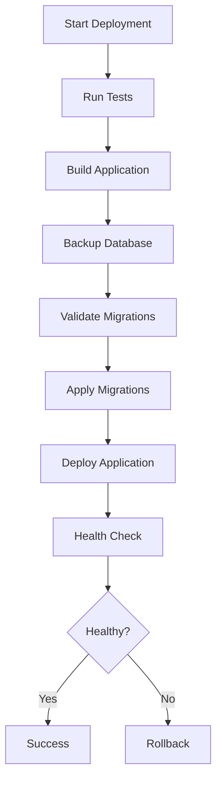

# Database Migration Rollback Procedures

## Overview

This document provides step-by-step procedures for rolling back database migrations in case of issues during deployment.

## Safety Features Implemented

1. **Automatic Backups**: Database backups are created before every deployment
2. **Migration Validation**: Migrations are validated for safety before being applied
3. **Safe Migration Commands**: Using `db:migrate` instead of `db:push` to prevent accidental schema drops
4. **Backup Retention**:
   - Staging: 7 days
   - Production: 30 days

## Pre-Deployment Workflow



## Backup Locations

### Railway Automatic Backups
- **Location**: Railway Dashboard → Database → Backups
- **Retention**: 7 days (Hobby plan)
- **Access**: Via Railway web interface

### Manual Script Backups
- **Location**: `backups/` directory (local to CI runner)
- **Format**: `pre-deploy-backup-YYYY-MM-DDTHH-MM-SS.sql`
- **Retention**: Configured via `BACKUP_RETENTION_DAYS` environment variable

## Rollback Scenarios

### Scenario 1: Migration Fails During Application

**Symptoms:**
- Migration step fails in GitHub Actions workflow
- Database is unchanged (migration was not applied)

**Action Required:**
- ✅ **NO ACTION NEEDED** - Deployment automatically stops
- Database remains in previous state
- Fix the migration issue and retry deployment

**Steps to Fix:**
1. Review migration error in GitHub Actions logs
2. Fix the migration file locally
3. Run `npm run db:generate` to regenerate migration
4. Commit and push the fix
5. Deployment will retry automatically

---

### Scenario 2: Migration Succeeds but Deployment Fails

**Symptoms:**
- Migration step succeeds
- Deployment or health check fails
- New database schema is applied but old code is running

**Danger Level:** ⚠️ MEDIUM - Schema and code are out of sync

**Action Required:**
1. **DO NOT** rollback the database schema
2. Fix the deployment issue or rollback application code
3. Ensure application code is compatible with new schema

**Why Not Rollback Schema?**
- Rolling back schema can cause data loss
- Breaking changes should be handled with backward-compatible migrations
- If absolutely necessary, use the backup restore procedure

---

### Scenario 3: Deployment Succeeds but Application Breaks

**Symptoms:**
- Deployment completes successfully
- Health checks pass initially
- Application errors appear after some time
- Database migration was applied

**Danger Level:** 🔴 HIGH - Production is affected

**Immediate Actions:**
1. **Rollback Application** (if possible via Railway dashboard)
2. **Assess Data Impact**
3. **Decision Point:**
   - If data was written with new schema → Keep schema, fix code
   - If no data was written with new schema → Consider schema rollback

---

## Database Rollback Procedures

### Option 1: Rollback via Railway Dashboard (Recommended)

**When to Use:**
- Within 24 hours of deployment
- No critical data written since migration
- Previous deployment was stable

**Steps:**
1. Go to Railway Dashboard: https://railway.app
2. Navigate to your service (Staging or Production)
3. Click "Deployments" tab
4. Find the previous deployment (before migration)
5. Click three dots (...) → "Rollback"
6. Confirm rollback
7. Monitor health checks

**Limitations:**
- Railway CLI v3 does not support programmatic rollback
- Must be done manually via web dashboard
- Cannot rollback to specific migration version (all-or-nothing)

---

### Option 2: Restore from Backup (Manual)

**When to Use:**
- Rollback via Railway dashboard is not available
- Need to restore to specific point in time
- Data corruption occurred

**Prerequisites:**
- Access to Railway CLI
- Backup file from `scripts/backup-database.js`
- Database credentials

**Steps:**

#### 1. Download Latest Backup
```bash
# List available backups in Railway
railway backups list --service <SERVICE_ID>

# Or use local backup from CI artifacts (if available)
# Check GitHub Actions artifacts for backup files
```

#### 2. Stop Application Traffic (Optional but Recommended)
```bash
# Scale down to prevent writes during restore
railway down --service <SERVICE_ID>
```

#### 3. Restore Database
```bash
# Using Railway CLI
railway run --service <SERVICE_ID> psql $DATABASE_URL < backup-file.sql

# Or using pg_restore if backup is in custom format
railway run --service <SERVICE_ID> pg_restore -d $DATABASE_URL backup-file.dump
```

#### 4. Verify Restoration
```bash
# Connect to database
railway run --service <SERVICE_ID> psql $DATABASE_URL

# Check table counts
SELECT
  schemaname,
  tablename,
  n_tup_ins - n_tup_del as row_count
FROM pg_stat_user_tables
ORDER BY tablename;

# Verify critical tables
SELECT COUNT(*) FROM users;
SELECT COUNT(*) FROM teams;
SELECT COUNT(*) FROM measurements;
```

#### 5. Restart Application
```bash
railway up --service <SERVICE_ID>
```

#### 6. Run Health Checks
```bash
node scripts/health-check.js
```

---

### Option 3: Create Reverse Migration (Safest for Production)

**When to Use:**
- Need to remove a recently added feature
- Want to preserve data integrity
- Have time to create proper reverse migration

**Steps:**

#### 1. Create Reverse Migration
```bash
# Example: If you added a column, create migration to remove it
# Edit shared/schema.ts to remove the change

# Generate new migration
npm run db:generate

# This creates a new migration that reverses the previous change
```

#### 2. Review Generated Migration
```bash
# Check the migration file in drizzle/migrations/
cat drizzle/migrations/XXXX_reverse_feature.sql

# Ensure it only reverses the intended change
# Should NOT contain DROP TABLE without IF EXISTS
```

#### 3. Test Locally
```bash
# Apply migration to local database
npm run db:migrate

# Test application functionality
npm run dev

# Run tests
npm run test:integration
```

#### 4. Deploy Reverse Migration
```bash
# Commit and push
git add .
git commit -m "feat: reverse migration for feature X"
git push origin develop

# Deployment workflow will:
# 1. Backup database
# 2. Validate migration
# 3. Apply reverse migration
# 4. Deploy code
```

---

## Prevention Best Practices

### 1. Write Backward-Compatible Migrations

**DO:**
```sql
-- Add nullable column (safe)
ALTER TABLE users ADD COLUMN middle_name TEXT;

-- Add column with default (safe)
ALTER TABLE users ADD COLUMN is_verified BOOLEAN DEFAULT false;

-- Create new table (safe)
CREATE TABLE user_preferences (...);
```

**DON'T:**
```sql
-- Drop column (data loss!)
ALTER TABLE users DROP COLUMN email;

-- Add non-nullable column without default (breaks existing code)
ALTER TABLE users ADD COLUMN required_field TEXT NOT NULL;

-- Rename column (breaks existing code)
ALTER TABLE users RENAME COLUMN email TO email_address;
```

### 2. Use Feature Flags

For breaking changes, use feature flags to:
1. Deploy new code with feature disabled
2. Apply database migration
3. Gradually enable feature
4. Monitor for issues

### 3. Test Migrations Locally

```bash
# Test migration
npm run db:generate
npm run db:migrate

# Test rollback (if using Drizzle rollback feature)
# Note: Drizzle Kit doesn't support automatic rollbacks
# You must create reverse migrations manually
```

### 4. Monitor After Deployment

- Watch application logs for errors
- Monitor database performance metrics
- Check error tracking (Sentry, etc.)
- Verify critical user flows

---

## Emergency Contacts

### If You Need Help

1. **Check GitHub Actions Logs**
   - Deployment workflow logs
   - Migration validation output
   - Backup status

2. **Check Railway Logs**
   - Application logs
   - Database logs
   - Deployment status

3. **Escalation Path**
   - Review docs/database-migration-rollback.md (this file)
   - Check Railway dashboard for automatic backups
   - Contact team lead if data loss is suspected

---

## Useful Commands

```bash
# Validate migrations locally
npm run db:validate

# Generate new migration
npm run db:generate

# Apply migrations locally
npm run db:migrate

# Push schema (development only - NEVER in production)
npm run db:push

# Backup database (via Railway)
node scripts/backup-database.js

# Health check
node scripts/health-check.js

# Connect to staging database
railway run --service <STAGING_SERVICE_ID> psql $DATABASE_URL

# Connect to production database
railway run --service <PRODUCTION_SERVICE_ID> psql $DATABASE_URL
```

---

## Migration Checklist

Before deploying migrations to production:

- [ ] Migration tested locally
- [ ] Migration tested in staging
- [ ] Backward compatibility verified
- [ ] Reverse migration planned (if needed)
- [ ] Team notified of deployment
- [ ] Backup verified in Railway dashboard
- [ ] Migration validation passes (`npm run db:validate`)
- [ ] Health check strategy defined
- [ ] Rollback plan documented
- [ ] Monitoring alerts configured

---

## Recent Improvements (v0.2.0)

1. ✅ Added automatic database backups before migrations
2. ✅ Switched from `db:push` to `db:migrate` for safer migrations
3. ✅ Added migration validation script
4. ✅ Updated CI/CD workflows with safety checks
5. ✅ Documented rollback procedures
6. ✅ Implemented backup retention policies

---

## References

- [Drizzle Kit Migrations](https://orm.drizzle.team/kit-docs/overview)
- [Railway Backups](https://docs.railway.app/reference/backups)
- [PostgreSQL Backup & Restore](https://www.postgresql.org/docs/current/backup.html)
